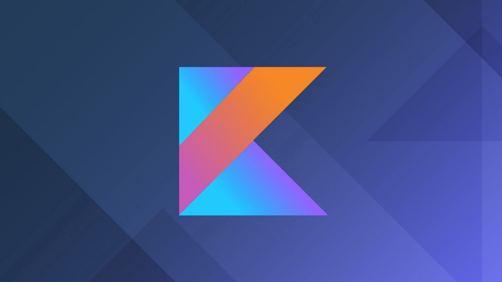

# 30 days of KOTLIN
For Training - 30 days kotlin challenge

 

This is a new series that I’m starting to help fellow programmers in their quest for learning Kotlin. I’ve decided to make it into a Q&A format and tried to answer some of the most frequently asked questions regarding Kotlin. So, let’s get started :)

## Why Kotlin?

Kotlin is a new-age programming language which incorporates both Object-oriented as well as functional programming features. Kotlin’s syntax is very much similar to Java and at the same time quite different. For, anyone with prior programming experience Kotlin would be quite easy to understand. So, let’s dive right in
